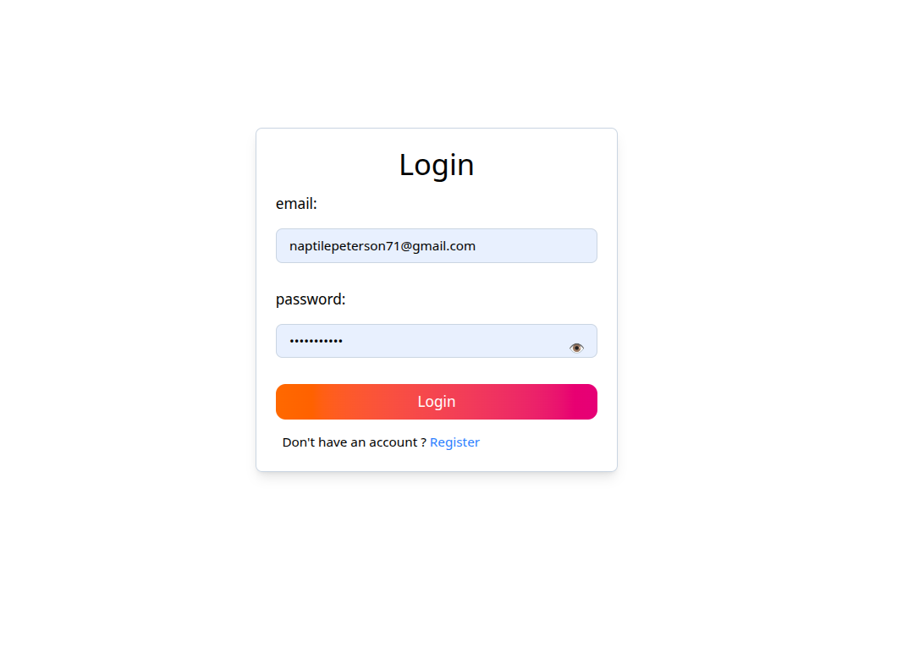
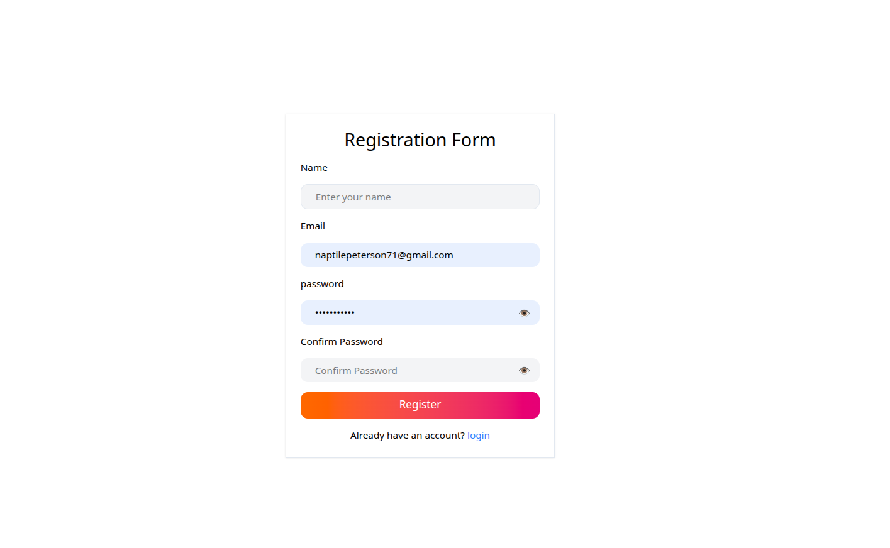
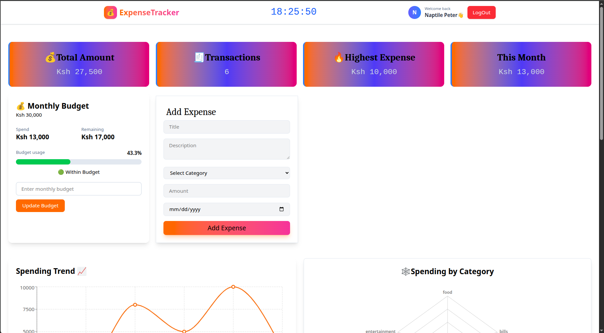
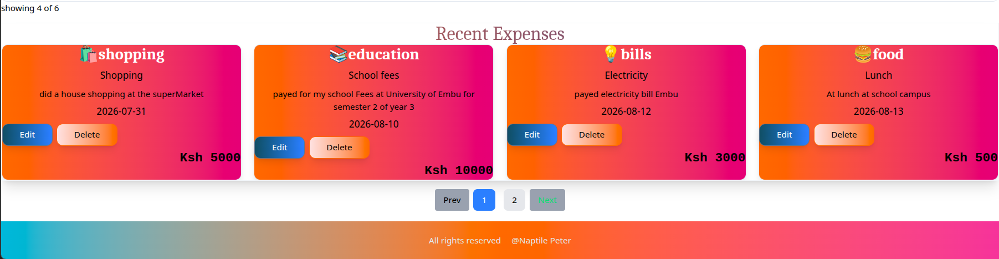
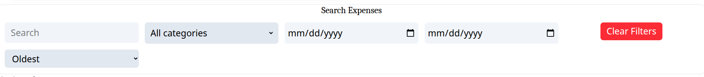
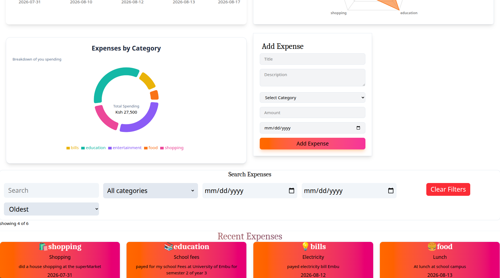
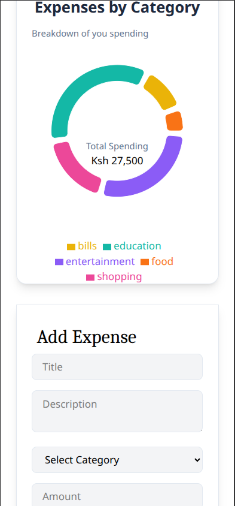
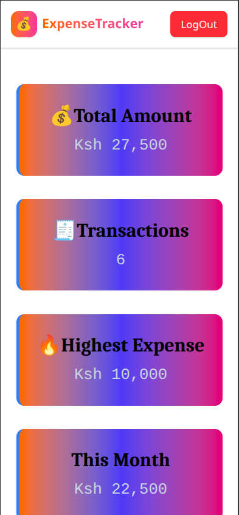

Absolutely 🥳🔥. Since we're about to push the Expense Tracker to GitHub, this is the perfect time to give it a **proper portfolio-level README**, similar to what we did for your Student Management System.

I'll structure it around what we've actually built so far — **not exaggerating features that aren't implemented yet**.

# 💰 Expense Tracker

A full-stack expense management application built with the **MERN stack**. The application allows users to securely manage their personal expenses, set monthly budgets, analyze spending patterns, and monitor their financial activity through an interactive dashboard.

The project was built with a strong focus on **authentication, authorization, responsive UI, data visualization, API security, and user experience**.

---

## 🚀 Live Demo

https://expense-tracker-beta-woad.vercel.app/

## 📂 Repository
https://github.com/Naptile/expenseTracker.git
## 📸 Screenshots

### 🔐 Authentication

#### Login



#### Registration



---

### 📊 Dashboard



---

### 💰 Expense Management



---

### 🔎 Search & Filtering



---

### 📈 Spending Analytics

#### Category Spending — Desktop



#### Category Spending — Mobile



---

### 📱 Responsive Design



---

# ✨ Features

## 🔐 Authentication & Authorization

* User registration
* Secure password hashing with bcrypt
* User login
* JWT-based authentication
* Protected API routes
* Authentication middleware
* User-specific data access
* Users can only access and modify their own expenses
* Automatic token handling through Axios interceptors
* Logout functionality

---

## 💰 Expense Management

Users can:

* Create expenses
* View their expenses
* View individual expenses
* Edit expenses
* Delete expenses
* Categorize expenses
* Add descriptions
* Specify expense dates
* Track expense amounts

Supported categories:

* 🍔 Food
* 🚗 Transport
* 🛍️ Shopping
* 💡 Bills
* 🎬 Entertainment
* 📚 Education

---

## 📊 Dashboard Analytics

The dashboard provides an overview of the user's financial activity.

### Statistics

* Total amount spent
* Total number of transactions
* Highest expense
* Current month's spending

### Charts

The application includes several visualizations:

* Category spending donut chart
* Spending trend chart
* Spending radar chart
* Monthly spending line chart

These charts help users understand their spending habits instead of relying only on raw expense records.

---

## 💵 Monthly Budget

Users can set a monthly spending budget.

The dashboard calculates:

* Monthly budget
* Amount spent
* Remaining budget
* Amount over budget
* Budget usage percentage
* Current spending status

The application provides visual feedback based on budget usage:

| Usage     | Status             |
| --------- | ------------------ |
| Below 70% | 🟢 Within Budget   |
| 70% – 89% | 🟠 Getting Close   |
| 90% – 99% | 🔴 Almost at Limit |
| 100%+     | 🚨 Over Budget     |

The budget is stored per user, month, and year.

A compound unique index prevents duplicate budgets for the same user and month:

```js
{
    user: 1,
    month: 1,
    year: 1
}
```

---

# 🔎 Expense Filtering & Search

Users can find expenses quickly using:

* Search
* Category filtering
* Date filtering
* Sorting

### Sorting options

* Newest
* Oldest
* Highest amount
* Lowest amount

The dashboard also displays the number of results being shown.

---

# 📄 Pagination

Expense records are paginated to prevent displaying a large number of records on a single page.

The application currently displays:

```text
4 expenses per page
```

Pagination works together with the filtering and sorting system.

---

# 🎨 User Experience

The application focuses on a clean and responsive user experience.

Implemented UX features include:

* Responsive layouts
* Loading states
* Empty states
* Toast notifications
* Confirmation before deleting expenses
* Responsive navigation
* Responsive dashboard cards
* Responsive charts
* Visual budget progress indicators
* User greeting and avatar
* Hover and transition effects

The application is designed to work across:

* 📱 Mobile
* 📱 Tablet
* 💻 Laptop
* 🖥️ Desktop

---

# 🛡️ Security

Security was considered on both the frontend and backend.

### JWT Authentication

Users receive a JWT after successful login.

The token is used to authenticate protected requests.

### Authorization

The authenticated user's ID is attached to:

```js
req.user
```

by the authentication middleware.

Controllers then use this ID to ensure users can only access their own data.

For example:

```js
const expense = await Expense.findOne({
    _id: req.params.id,
    user: req.user
});
```

This prevents one user from accessing another user's expense simply by changing the expense ID.

### Password Security

Passwords are hashed using:

```text
bcrypt
```

before being stored in MongoDB.

### Environment Variables

Sensitive configuration is stored in environment variables rather than directly inside the source code.

Examples include:

```env
MONGO_URI=
JWT_SECRET=
PORT=
```

The `.env` file is excluded from Git using `.gitignore`.

---

# 🚨 Centralized Error Handling

The backend uses a centralized Express error-handling middleware.

Instead of handling every unexpected error independently inside each controller, controllers can pass errors using:

```js
next(error);
```

The global error middleware then handles the error.

The application currently recognizes errors such as:

* Mongoose validation errors
* Invalid MongoDB ObjectId errors
* Duplicate key errors
* Unexpected server errors

This keeps the controllers cleaner and makes API responses more consistent.

---

# 🧠 Backend Validation

Mongoose schemas provide additional validation before data reaches MongoDB.

Examples include:

### Expense amount

```js
amount: {
    type: Number,
    required: true,
    min: 0
}
```

### Expense category

```js
category: {
    type: String,
    required: true,
    enum: [
        "food",
        "transport",
        "shopping",
        "bills",
        "entertainment",
        "education"
    ]
}
```

This means the backend does not rely entirely on frontend validation.

---

# 🏗️ Project Architecture

The project follows a separation between the frontend and backend.

```text
expenseTracker/
│
├── backed/
│   │
│   ├── config/
│   │   └── db.js
│   │
│   ├── controllers/
│   │   ├── authController.js
│   │   ├── expenseController.js
│   │   └── budgetController.js
│   │
│   ├── middleware/
│   │   ├── authMiddleware.js
│   │   └── errorMiddleware.js
│   │
│   ├── models/
│   │   ├── user.js
│   │   ├── expense.js
│   │   └── budget.js
│   │
│   ├── routes/
│   │   ├── authRoutes.js
│   │   ├── expenseRoutes.js
│   │   └── budgetRoutes.js
│   │
│   ├── .env
│   ├── .gitignore
│   ├── package.json
│   └── server.js
│
└── frontend/
    │
    ├── src/
    │   │
    │   ├── components/
    │   │   ├── Navbar.jsx
    │   │   ├── StatCard.jsx
    │   │   ├── ExpenseForm.jsx
    │   │   ├── ExpenseList.jsx
    │   │   ├── Filter.jsx
    │   │   ├── Pagination.jsx
    │   │   ├── BudgetCard.jsx
    │   │   ├── CategoryChart.jsx
    │   │   ├── ExpenseTrendChart.jsx
    │   │   ├── SpendingRadarChart.jsx
    │   │   └── MonthlySpendingChart.jsx
    │   │
    │   ├── pages/
    │   │   └── Dashboard.jsx
    │   │
    │   ├── services/
    │   │   └── api.js
    │   │
    │   └── ...
    │
    ├── package.json
    └── ...
```

---

# 🛠️ Technologies Used

## Frontend

* React
* React Router
* Tailwind CSS
* Axios
* Recharts
* React Toastify

## Backend

* Node.js
* Express.js
* MongoDB
* Mongoose
* JWT
* bcrypt
* CORS
* dotenv

---

# 📦 Installation

## 1. Clone the repository

```bash
git clone <your-repository-url>
```

Move into the project:

```bash
cd expenseTracker
```

---

# ⚙️ Backend Setup

Move into the backend directory:

```bash
cd backed
```

Install dependencies:

```bash
npm install
```

Create a `.env` file:

```env
PORT=5000
MONGO_URI=your_mongodb_connection_string
JWT_SECRET=your_strong_jwt_secret
```

Start the backend:

```bash
npm run dev
```

The API should run on:

```text
http://localhost:5000
```

---

# 💻 Frontend Setup

Open another terminal and move into the frontend:

```bash
cd frontend
```

Install dependencies:

```bash
npm install
```

Start the development server:

```bash
npm run dev
```

The frontend will be available through the Vite development URL displayed in your terminal.

---

# 🔌 API Endpoints

## Authentication

| Method | Endpoint             | Description            |
| ------ | -------------------- | ---------------------- |
| POST   | `/api/auth/register` | Register a user        |
| POST   | `/api/auth/login`    | Login                  |
| GET    | `/api/auth/me`       | Get authenticated user |

---

## Expenses

| Method | Endpoint            | Description         |
| ------ | ------------------- | ------------------- |
| POST   | `/api/expenses`     | Create expense      |
| GET    | `/api/expenses`     | Get user's expenses |
| GET    | `/api/expenses/:id` | Get one expense     |
| PUT    | `/api/expenses/:id` | Update expense      |
| DELETE | `/api/expenses/:id` | Delete expense      |

> Adjust the endpoint prefix if your final route configuration differs.

---

## Budget

| Method | Endpoint      | Description                          |
| ------ | ------------- | ------------------------------------ |
| PUT    | `/api/budget` | Create or update monthly budget      |
| GET    | `/api/budget` | Get budget for a selected month/year |

---

# 🔄 Authentication Flow

The authentication process works approximately like this:

```text
User
 │
 ▼
Login Form
 │
 ▼
POST /api/auth/login
 │
 ▼
Express Controller
 │
 ▼
Check user
 │
 ▼
bcrypt password comparison
 │
 ▼
Generate JWT
 │
 ▼
Frontend stores token
 │
 ▼
Axios interceptor attaches token
 │
 ▼
Protected API request
 │
 ▼
authMiddleware
 │
 ▼
Verify JWT
 │
 ▼
req.user = decoded.id
 │
 ▼
Controller
```

---

# 🗄️ Database Models

## User

A user contains:

```text
name
email
password
monthlyBudget
createdAt
updatedAt
```

## Expense

An expense contains:

```text
title
description
category
amount
date
user
createdAt
updatedAt
```

## Budget

A budget contains:

```text
user
month
year
amount
createdAt
updatedAt
```

The budget model uses a compound unique index to prevent multiple budgets for the same user in the same month and year.

---

# 📈 What I Learned From This Project

This project helped strengthen practical full-stack development skills including:

* Building REST APIs with Express
* Designing MongoDB schemas with Mongoose
* Implementing JWT authentication
* Implementing authorization
* Protecting user-specific resources
* Password hashing with bcrypt
* React state management
* React hooks
* Axios API integration
* Axios interceptors
* Protected routes
* Reusable React components
* Data visualization with Recharts
* Search and filtering
* Sorting
* Pagination
* Monthly budget calculations
* Responsive UI development with Tailwind CSS
* Loading and empty states
* API error handling
* Centralized Express error handling
* Environment variable management
* Full-stack application architecture

---

# 🚧 Future Improvements

Possible future improvements include:

* Dark mode
* Export expenses to CSV/PDF
* Recurring expenses
* More advanced financial reports
* Yearly spending analytics
* Custom expense categories
* Budget history
* Email notifications
* Password reset
* Profile management
* Deployment and production monitoring

---

# 👨‍💻 Author

**Naptile Peter**

Computer Scientist and full-stack developer focused on building practical web applications using modern technologies.

### Technologies I enjoy working with

* MERN Stack
* React
* Node.js
* Express
* MongoDB
* Tailwind CSS
* Next.js

---

# ⭐ Project Status

**Development status: Active**

The core expense management, authentication, authorization, analytics, filtering, pagination, and monthly budgeting functionality has been implemented.

More production and deployment improvements will continue to be added.

---

## ⭐ If you find this project useful

Feel free to explore the repository, review the implementation, and follow the project's development.
